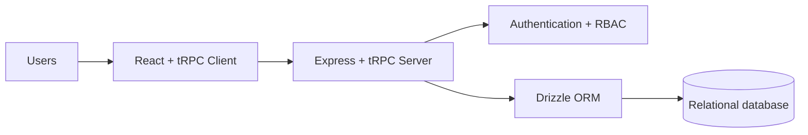
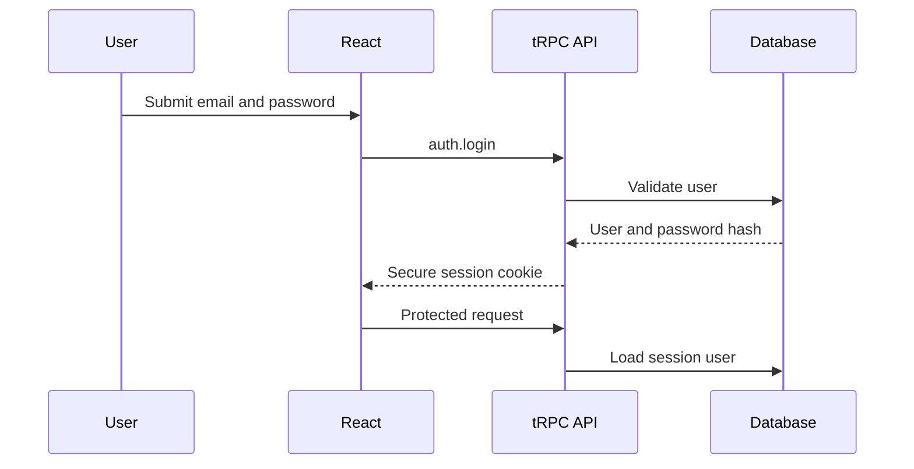

<div align="center">

**English** | [Português](README.pt-BR.md)

# Nexus Academic

**Research, Development and Innovation project management for an academic environment.**

</div>

Nexus Academic is a full-stack platform for managing research projects, student proposals, skills, participation requests, project members, timelines and notifications at FATEC Pompéia.

## Architecture



## Project goals

- Demonstrate a modern full-stack TypeScript application
- Connect a React frontend to an Express and tRPC backend
- Model relational academic workflows through Drizzle ORM
- Support student, professor and administrator roles
- Represent a complete academic R&D and innovation workflow

## Main capabilities

- User registration and authentication
- Professor project management
- Student proposal submission and review
- Skill and project-member management
- Participation requests and approval workflows
- Timeline events, project tasks and notifications
- Role-protected dashboards and administration routes

## Technology stack

| Layer | Technologies |
| --- | --- |
| Frontend | React 19, TypeScript 5.9, Vite, Wouter and Tailwind CSS |
| Components and data | shadcn/ui, Recharts, TanStack Query and tRPC Client |
| Backend | Node.js 22, Express and tRPC Server |
| Data | Drizzle ORM with relational database support |
| Validation and security | Zod, bcrypt, jose and secure session cookies |
| Quality | Vitest, TypeScript checks and Prettier |

## Development approach

1. Set up the project with pnpm, Vite, React and TypeScript.
2. Design users, projects, proposals, skills and approval relationships in `drizzle/schema.ts`.
3. Build the Express and tRPC backend in `server/_core/index.ts` and `server/routers.ts`.
4. Implement local authentication and secure sessions in `server/auth-local.ts`.
5. Create public and protected frontend routes in `client/src`.
6. Share critical constants and types through `shared/`.
7. Validate behavior with Vitest and TypeScript checks.

## Main data model

The Drizzle schema includes:

- Users and user skills
- Professor projects and student proposals
- Required project skills and project members
- Participation requests
- Project timelines and tasks
- Notifications

## Authentication flow



The backend enforces authentication through `protectedProcedure` and administrator authorization through `adminProcedure`. Frontend route protection improves navigation but is not the security boundary.

## Project and proposal workflow

- Professors create and maintain projects.
- Students submit project proposals.
- Professors and administrators review, approve or reject proposals.
- Approved proposals can be connected to official projects.
- Participation requests and project membership are stored in normalized tables.
- Dashboards expose indicators and pending actions for each role.

## Project structure

```text
nexus_academic/
|-- client/              # React and Vite frontend
|-- drizzle/             # Drizzle schema and relationships
|-- server/              # Express, tRPC, authentication and data access
|-- shared/              # Shared constants and TypeScript types
|-- check-db.js
|-- migrate.js
|-- migrate-tasks.ts
|-- package.json
|-- tsconfig.json
`-- vite.config.ts
```

Important backend files:

- `server/_core/index.ts`: Express startup, parsers, tRPC and static delivery
- `server/_core/trpc.ts`: public, protected and administrator procedures
- `server/_core/context.ts`: session user loading
- `server/auth-local.ts`: password validation, BCrypt and login lockout
- `server/db.ts`: Drizzle queries and data operations
- `server/routers.ts`: authentication, projects, requests, skills and administration procedures

## Requirements

- Node.js 22 or newer
- pnpm 10 or newer
- SQLite, MySQL or TiDB according to the selected configuration
- Required environment variables configured locally

## Install and run

```bash
pnpm install
pnpm dev
```

Production:

```bash
pnpm build
pnpm start
```

## Commands

| Command | Action |
| --- | --- |
| `pnpm dev` | Start the development server |
| `pnpm build` | Build the frontend and package the backend |
| `pnpm start` | Start the production application |
| `pnpm check` | Run TypeScript checks |
| `pnpm format` | Format code with Prettier |
| `pnpm test` | Run tests |
| `pnpm db:push` | Generate and apply Drizzle migrations |

## tRPC API overview

| Namespace | Procedures |
| --- | --- |
| `auth` | `me`, `logout` |
| `projects` | `list`, `byId`, `create`, `update`, `delete`, `myProjects`, member, skill and timeline operations |
| `requests` | `create`, `listByProject`, `myRequests`, `allPending`, `review` |
| `skills` | `list`, `create`, `mySkills`, `addToProfile`, `removeFromProfile` |
| `dashboard` | `stats` |
| `profile` | `get`, `update` |
| `admin` | `users`, `updateUserRole`, `allProjects` |

## License

MIT - FATEC Pompéia Integration Project, 2026.
